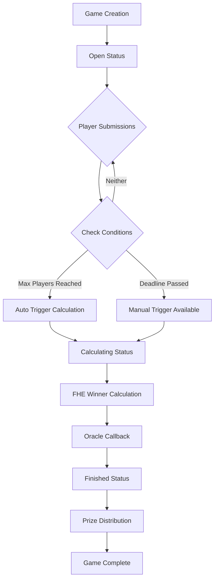

# 唯一数字游戏流程文档 (Unique Number Game Flow)

## 游戏概述

唯一数字游戏是基于 Zama FHEVM 完全同态加密技术的区块链游戏。玩家提交加密的数字，系统在不解密的情况下计算出获胜者，确保游戏过程的公平性和隐私性。

## 游戏核心机制

### 🎯 游戏目标
玩家需要提交一个在指定范围内的**唯一数字**。如果只有一个玩家选择了某个数字，该玩家获胜并赢得奖池。

### 🔑 关键特性
- **完全隐私**: 使用 FHE 技术，所有数字在游戏过程中保持加密状态
- **公平竞争**: 无人能提前知道其他玩家选择的数字
- **自动执行**: 智能合约自动处理游戏逻辑和奖励分发

## 游戏生命周期

### 1. 游戏创建阶段 (Game Creation)

**创建者设置游戏参数**:
```typescript
createGame(
  roomName: string,      // 房间名称 (1-64字符)
  minNumber: number,     // 最小数字
  maxNumber: number,     // 最大数字 (范围不超过255)
  maxPlayers: number,    // 最大玩家数 (≥2)
  entryFee: bigint,      // 入场费用 (ETH)
  deadlineDuration: number // 截止时间 (秒)
)
```

**游戏状态**: `Open` (开放状态)

**事件触发**: `GameCreated`

### 2. 玩家参与阶段 (Player Participation)

**玩家提交加密数字**:
```typescript
submitNumber(
  gameId: number,
  encryptedNumber: Handle,    // FHE加密的数字
  inputProof: bytes,          // 零知识证明
  { value: entryFee }         // 入场费
)
```

**参与条件**:
- ✅ 支付正确的入场费
- ✅ 在截止时间前提交
- ✅ 未曾提交过数字
- ✅ 游戏状态为 `Open`
- ✅ 未达到最大玩家数限制

**事件触发**: `SubmissionReceived`

### 3. 游戏结束触发条件

游戏有两种结束方式：

#### 方式一：达到最大玩家数 🏁
```typescript
// 当提交的玩家数达到 maxPlayers 时自动触发
if (playerCount == maxPlayers) {
    status = GameStatus.Calculating;
    // 触发 FHE 计算请求
    requestWinnerCalculation();
}
```

#### 方式二：截止时间到达 ⏰
```typescript
// 任何人都可以在截止时间后手动触发
findWinnerByDeadline(gameId) external {
    require(block.timestamp > games[gameId].deadline, "Deadline has not passed yet");
    require(games[gameId].playerCount > 0, "No players in the game");
    
    games[gameId].status = GameStatus.Calculating;
    requestWinnerCalculation();
}
```

### 4. 获胜者计算阶段 (Winner Calculation)

**游戏状态**: `Calculating`

**🎯 优化后的FHE计算过程**:
1. **批量解密**: 一次性解密所有玩家提交的加密数字
2. **明文计算**: 在解密后的数组中进行高效计算
   - 统计每个数字的出现频次
   - 找出所有唯一数字（出现次数=1）
   - 在唯一数字中选择最小值
   - 通过索引直接获得获胜者地址

**计算逻辑示例**:
```javascript
解密结果: [3, 5, 3, 7, 5] // 对应玩家 [A, B, C, D, E]
统计频次: {3: 2, 5: 2, 7: 1}
唯一数字: [7] 
最小唯一: 7
获胜者索引: 3 (数字7在原数组的位置)
获胜者: gamePlayerAddresses[3] = 玩家D
```

**优势**:
- ⚡ **性能最优**: 只需1次FHE解密操作
- 🧮 **逻辑简洁**: 后续都是Gas成本低的明文计算
- 🎯 **结果完整**: 同时获得获胜数字和获胜者地址

**可能的结果**:
- **有获胜者**: 找到唯一最小数字的玩家
- **无获胜者**: 所有数字都被多人选择
- **多个唯一数字**: 选择最小的唯一数字对应的玩家

**事件触发**: `WinnerCalculationStarted`

### 5. 结果揭示阶段 (Result Revelation)

**游戏状态**: `Finished`

**🎯 优化后的FHE回调处理**:
```solidity
// 由 Zama 预言机调用 - 新的简化回调
function callbackDecryptAllSubmissions(
    uint256 requestId,
    uint32[] memory decryptedNumbers,
    bytes[] memory signatures
) external {
    // 1. 验证签名和请求ID
    FHE.checkSignatures(requestId, signatures);
    
    // 2. 统计数字频次，找到唯一数字
    // 3. 选择最小的唯一数字
    // 4. 通过索引确定获胜者
    // 5. 更新游戏状态和统计数据
}
```

**核心优势**:
- 🚀 **一步到位**: 直接从解密结果确定最终获胜者
- 📊 **完整信息**: 获胜数字 + 获胜者地址 + 游戏结果
- ⛽ **Gas优化**: 避免了复杂的FHE比较操作

**处理流程**:
1. **验证**: 签名验证和请求ID映射
2. **统计**: 计算每个数字的出现频次  
3. **筛选**: 找出所有唯一数字（frequency = 1）
4. **选择**: 在唯一数字中选择最小值
5. **确定**: 通过数组索引直接获得获胜者地址
6. **更新**: 保存结果并更新统计数据

**事件触发**: 
- `WinnerDetermined` (有获胜者)
- `NoWinnerDetermined` (平局退款)

### 6. 奖励领取阶段 (Prize Claiming)

**有获胜者情况**:
- 获胜者调用 `claimPrize()` 领取全部奖池
- 奖池一次性转给获胜者
- 游戏状态变为 `PrizeClaimed`

**平局退款机制** 🔄:
- 如果无获胜者，启动退款机制
- 每个参与者可申请 **90% 入场费退款**
- **10% 作为平台费**，累积到平台费池中
- 调用 `claimRefund(gameId)` 申请退款

**平台费管理** 💰:
- 合约创建者可调用 `withdrawPlatformFees()` 提取累积费用
- 只有合约所有者有权限提取
- 支持所有权转移功能

**玩家统计更新**:
- 游戏参与次数 (`gamesPlayed`)
- 获胜次数 (`gamesWon`)
- 总奖金 (`totalWinnings`)

**获胜历史记录**: 记录到全局获胜者历史中

## 游戏状态流转图



## 重要时间节点

### 截止时间处理 ⏰

**截止前** (`block.timestamp <= deadline`):
- ✅ 玩家可以提交数字
- ❌ 不能手动触发计算

**截止后** (`block.timestamp > deadline`):
- ❌ 玩家不能再提交数字
- ✅ 任何人可以调用 `findWinnerByDeadline()`
- ✅ 如果有玩家参与，自动开始计算

### 最大玩家数处理 👥

**未满员** (`playerCount < maxPlayers`):
- ✅ 继续接受新玩家
- ❌ 不触发自动计算

**满员** (`playerCount == maxPlayers`):
- ❌ 不再接受新玩家
- ✅ 立即触发获胜者计算
- ⚡ 即使未到截止时间也开始计算

## 特殊情况处理

### 无玩家参与
```typescript
// 截止时间后如果无人参与
require(games[gameId].playerCount > 0, "No players in the game");
```

### 重复计算保护
```typescript
// 防止重复触发计算
require(games[gameId].status == GameStatus.Open, "Game is not open");
```

### 平局处理逻辑 🎯

**获胜者确定规则**:
1. **唯一数字**: 只有一个玩家选择的数字
2. **最小值优先**: 如有多个唯一数字，选择最小的
3. **无获胜者**: 所有数字都被多人选择

**平局场景**:
```typescript
// 情况1: 所有玩家选择相同数字 → 无获胜者，启动退款
// 玩家A: 5, 玩家B: 5, 玩家C: 5 → 退款

// 情况2: 多个唯一数字 → 最小值获胜
// 玩家A: 1, 玩家B: 5, 玩家C: 8 → 玩家A获胜(选择1)

// 情况3: 混合场景 → 找唯一最小值
// 玩家A: 2, 玩家B: 2, 玩家C: 7 → 玩家C获胜(7唯一)
```

### 退款安全机制 🛡️

**防重复申请**:
```typescript
mapping(uint256 => mapping(address => bool)) public hasClaimedRefund;
require(!hasClaimedRefund[gameId][msg.sender], "Refund already claimed");
```

**参与验证**:
```typescript
require(hasPlayerSubmitted[gameId][msg.sender], "You did not participate");
```

**费用分配**:
- **玩家退款**: 90% 入场费 (`REFUND_PERCENTAGE = 9000`)
- **平台费**: 10% 入场费 (自动累积到 `platformFees`)

### Mock 环境限制
- 在测试环境中，FHE 回调不会自动执行
- 游戏状态会停留在 `Calculating`
- 需要手动模拟回调过程进行完整测试

## 🚀 技术优化亮点

### 新架构优势

**原始方案 vs 优化方案对比**:

| 方面 | 原始方案 | 🎯 优化方案 |
|------|----------|------------|
| **FHE解密次数** | 2次 (数字→索引) | **1次** (批量解密) |
| **FHE比较操作** | 大量复杂循环 | **0次** |
| **Gas成本** | 高 | **显著降低** |
| **代码复杂度** | 复杂的FHE逻辑 | **简洁明文计算** |
| **获胜者确定** | 多步骤 | **一步到位** |

### 核心技术创新

**🔍 智能解密策略**:
```solidity
// 老方案：先找数字，再找玩家 (2次解密)
1. 解密获胜数字 → 2. 解密所有提交找玩家

// 新方案：直接解密所有，一次计算完成 (1次解密)  
1. 批量解密所有提交 → 2. 明文计算确定获胜者
```

**📊 算法优化**:
```javascript
// 高效的获胜者计算算法
function findWinner(numbers: number[]): {winner: address, number: number} {
    // O(n) 时间复杂度，一次遍历完成所有计算
    const frequency = countFrequency(numbers);      // 统计频次
    const uniqueNumbers = getUniqueNumbers(frequency); // 找唯一数字  
    const minUnique = Math.min(...uniqueNumbers);      // 找最小值
    const winnerIndex = numbers.indexOf(minUnique);    // 找获胜者索引
    return { winner: players[winnerIndex], number: minUnique };
}
```

## 查询功能

### 游戏查询
- `getAllGames()`: 获取所有游戏
- `getActiveGames()`: 获取活跃游戏
- `getGamesByStatus(status)`: 按状态筛选游戏
- `getGameSummary(gameId)`: 获取游戏摘要
- `canFinalizeGame(gameId)`: 检查是否可以结束游戏

### 玩家统计
- `getPlayerStats(player)`: 获取玩家统计
- `getPlayerGames(player)`: 获取玩家参与的游戏
- `getLeaderboard(limit)`: 获取排行榜
- `getWinnerHistory(limit)`: 获取获胜历史

### 平局与退款查询
- `canClaimRefund(gameId, player)`: 检查是否可申请退款
- `hasClaimedRefund(gameId, player)`: 检查是否已申请退款
- `getPlatformFees()`: 获取当前平台费余额

### 平台管理
- `owner()`: 获取合约所有者
- `withdrawPlatformFees()`: 提取平台费（仅所有者）
- `transferOwnership(newOwner)`: 转移所有权（仅所有者）

## 安全考虑

### 输入验证
- 房间名长度限制 (1-64字符)
- 数字范围验证 (最大255范围)
- 最小玩家数限制 (≥2)
- 入场费精确匹配

### 防重放攻击
- 玩家提交状态跟踪
- 游戏状态严格控制
- 时间戳验证

### FHE 安全
- 零知识证明验证
- 预言机权限控制
- 加密数据完整性

### 平局退款安全 🔒
- **重入攻击防护**: 使用 Check-Effects-Interactions 模式
- **重复申请防护**: `hasClaimedRefund` 映射跟踪
- **权限验证**: 只有参与者可申请退款
- **数学精度**: 使用 `PERCENTAGE_BASE = 10000` 保证精度

### 平台费安全
- **所有权控制**: 只有合约所有者可提取
- **零地址保护**: 防止转移所有权到零地址
- **余额检查**: 提取前验证余额存在

### 生产环境考虑
- **Gas优化**: FHE操作比普通操作消耗更多Gas
- **事件监听**: 客户端需监听 `NoWinnerDetermined` 和 `RefundClaimed` 事件
- **错误处理**: 完善的错误消息和回滚机制

---

*本文档基于 UniqueNumberGameFactory.sol 合约和相关测试文件分析编写。*